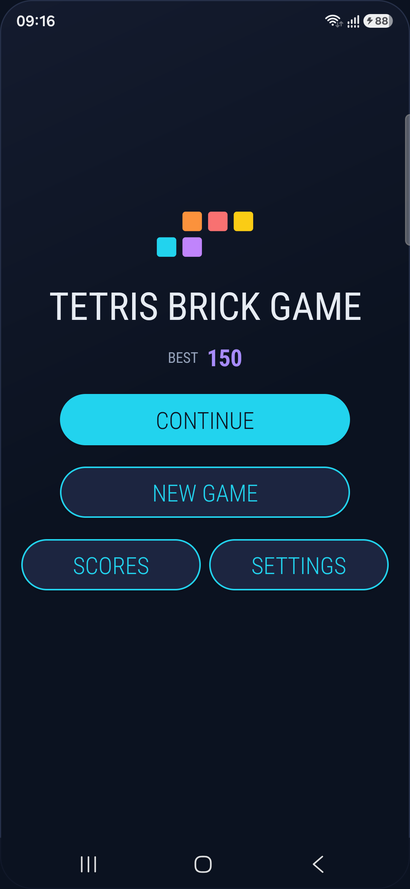
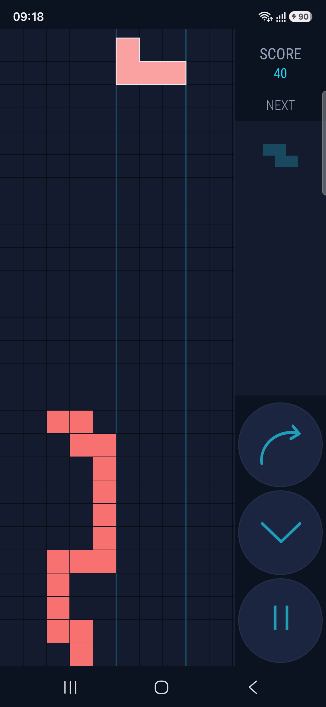
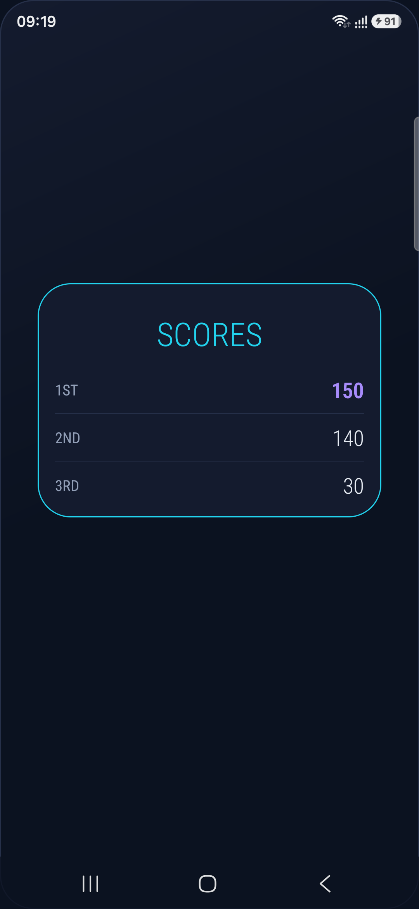
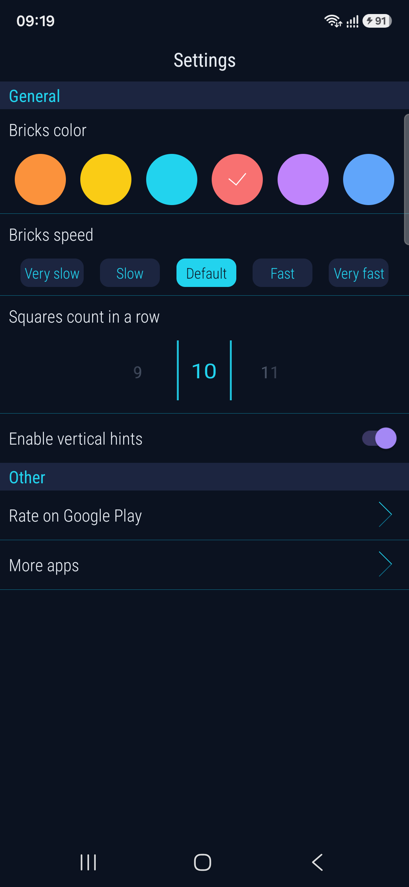

# Tetris Brick Game

A lightweight Tetris-style puzzle game for Android, built with a custom Canvas 2D
gameplay engine (no game framework/engine dependency).

**Current production release: versionCode 6 / versionName "6.0"**, confirmed published
by the app owner. See `CLAUDE_PROGRESS.md` for the full modernization history and
`RELEASE_CHECKLIST.md` for what's been verified vs. what's still open for the *next*
release.

How to play:

- Tap or swipe left/right to move the falling brick.
- Fill a row completely to clear it and score.
- Use the on-screen controls to rotate the brick or drop it down fast.
- Pause and resume at any time.
- View your top 3 scores.
- Customize the playing experience in Settings.

Features:

- Play offline - no account, no network dependency for gameplay.
- No in-app purchases.
- Contains banner ads (Google AdMob). See "Advertising" below.
- "Next brick" preview.
- Pick your preferred brick color.
- Choose brick fall speed.
- Optional vertical alignment hints.
- Configurable squares-per-row (board width).
- Notification when you set a new best score.
- An in-progress game is saved and restored if the app is closed or the OS
  reclaims it mid-game - you come back to a paused game, not a lost one.
- Dark, cyan/violet arcade theme with edge-to-edge system-bar support.

## Advertising

This app shows a banner ad (Google AdMob) on every screen, one placement per screen
(Home, Gameplay, Scores, Settings - each its own ad unit, not a single shared banner).
There is no rewarded-ad flow. Ad requests are gated behind a GDPR/UMP consent check,
and Settings has a "Privacy options" entry for revisiting your consent choice where
required. Ads never block gameplay - a failed, declined, or offline ad load is
silently skipped.

## Building

Requires JDK 17 and the Android SDK (compileSdk 37). Debug builds work out of the box
with no extra configuration - they always use Google's official test ad IDs, never
real ones:

```
./gradlew :app:assembleDebug
```

### Release builds

Two local, gitignored config files are required - a release build fails fast with a
clear error if either is missing or incomplete, so it's impossible to accidentally
ship a release secretly using test ad IDs or no signing config:

1. **AdMob**: copy `admob.properties.example` to `admob.properties` and fill in your
   own production AdMob App ID and the four per-screen banner ad unit IDs. See that
   file for the exact property names.
2. **Signing**: copy `keystore.properties.example` to `keystore.properties` and point
   it at your own release-signing keystore (kept outside this repository). See that
   file for the exact property names.

```
./gradlew :app:bundleRelease   # AAB, for Play Console
./gradlew :app:assembleRelease # APK
```

See `CLAUDE_PROGRESS.md` / `RELEASE_CHECKLIST.md` for the full rationale and current
release-readiness status.

## Development notes

See `CLAUDE_PROGRESS.md` for the modernization history, architectural decisions, and
current state of the codebase, and `RELEASE_CHECKLIST.md` before shipping a Play Store
update.

<p align="center">
  
  
  
  
</p>

*Current dark navy/cyan/violet theme, captured from a real device
(`docs/design/branding/store-screenshots/` has all six screens; see
`docs/design/branding/` for the launcher icon in its various forms).*
